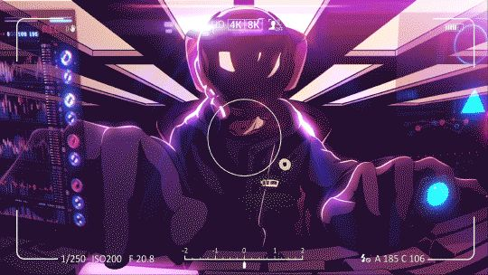

# ✧ NIX VAIL ✧
### "building your own world" 🛰️

 

    

 

<h4>📈 Your Contribution History</h4>

 
 

<table width="100%">
  <tr>
    <td width="50%" align="center">
      <h4>⚡ Current Streak</h4>
      
    </td>
    <td width="50%" align="center">
      <h4>📊 Language Overview</h4>
      
    </td>
  </tr>
</table>

 
 

<h3>📈 Nix Vail Graph</h3>

 

---

### 🌙 Late Night Coder | 🦾 Future Engineer 
*Currently diving deep into **CS50** and building a **Digital Second Brain** in Obsidian.*

[ 💌 ] **t.me/nikavaslnix** | [ 📧 ] **vasilishenanika@gmail.com**

