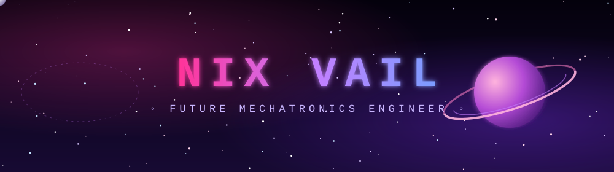
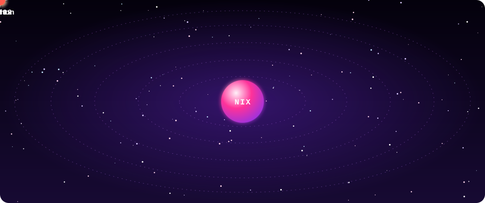

<div align="center">



<p align="center">
  
</p>

<p align="center">
  <a href="https://wakatime.com/@2c21fab2-044d-474d-96bf-3bcf013cc7ed">
    
  </a>
</p>

<br/>

<h3> ⛧ Tech Stack ⛧ </h3>

<p align="center">
  
  
  
  
  
  
</p>

<br/>

<h3> 𓁹 ✧ About Me ✧ 𓁹 </h3>

</div>

```c
#include <stdio.h>

typedef struct {
    const char *name;
    const char *goal;
    const char *stack[5];
    const char *mode;
} Engineer;

int main(void) {
    Engineer nix = {
        .name  = "Nix Vail",
        .goal  = "Mechatronics Engineer",
        .stack = {"Python", "C", "C++", "Linux", "ESP32"},
        .mode  = "late night coding"
    };

    printf("%s -> %s\n", nix.name, nix.goal);
    return 0;
}
```

<div align="center">

<br/>

<h3> 🛠️ Currently Working On 🛠️ </h3>

<p align="center">
  <b><a href="https://github.com/nixnika17/НАЗВА-РЕПОЗИТОРІЮ">⚡ Project Name Here</a></b><br/>
  <sub>Short description of what you are building right now</sub>
</p>

<p align="center">
  
  
</p>

<br/>

<h3> ⛧ Current Power ⛧ </h3>


<br/>
<br/>

<h3> 𓊈 ✧ Tech Orbit ✧ 𓊉 </h3>



<br/>
<br/>

### 🌙 Late Night Coder | 🦾 Future Engineer
> "Everything is an algorithm if you look closely enough."

<br/>

<a href="https://t.me/nikavaslnix"></a>
<a href="mailto:vasilishenanika@gmail.com"></a>

<br/>
<br/>


</div>
